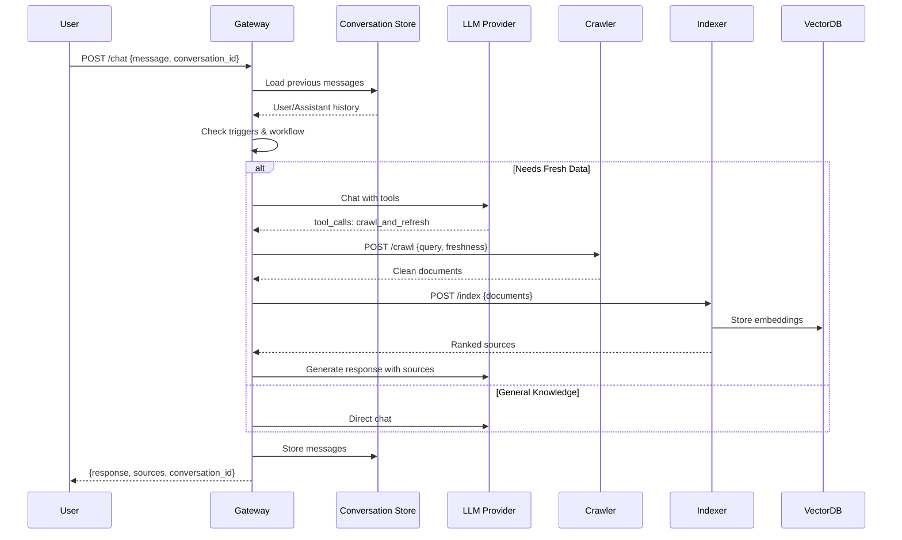
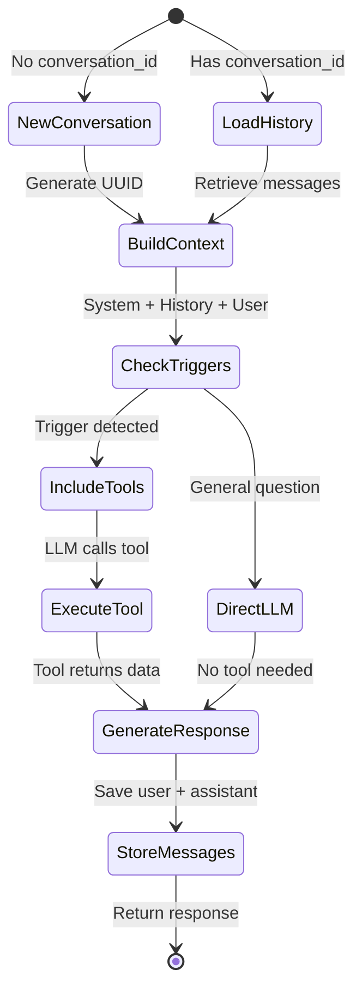

# LLMCrawl System Architecture

## Overview

LLMCrawl is a production-grade Web RAG system that combines LLM chat capabilities with real-time web crawling and semantic search. The system features conversation memory, intelligent tool calling, multi-source web scraping, and workflow-based interactions.

## System Architecture

```
┌─────────────────────────────────────────────────────────────────┐
│                         CLIENT LAYER                             │
├─────────────────────────────────────────────────────────────────┤
│  HiChat Web Client  │  HiChat CLI  │  REST API  │  cURL         │
└────────────────────────────────┬────────────────────────────────┘
                                 │
                      HTTP POST /agent/chat
                                 │
┌────────────────────────────────▼────────────────────────────────┐
│                    GATEWAY SERVICE (Port 8000)                   │
├──────────────────────────────────────────────────────────────────┤
│  • FastAPI REST API                                              │
│  • Multi-Provider LLM Support (OpenAI, Azure, Anthropic, Claude) │
│  • Workflow System (General Chat, Code Analysis, Build, Explorer)│
│  • Conversation Store (In-Memory, 24h TTL)                       │
│  • Tool Calling & Orchestration                                  │
│  • Prompt Compression (LLMLingua-2 / tiktoken fallback)         │
└────┬────────────┬───────────────┬────────────────────────────────┘
     │            │               │
     │ Tool Call  │               │ Index Request
     │            │               ▼
     │            │   ┌────────────────────────────────────────────┐
     │            │   │      INDEXER SERVICE (Port 8002)           │
     │            │   ├────────────────────────────────────────────┤
     │            │   │  • LlamaIndex Document Processing          │
     │            │   │  • Embedding Generation                    │
     │            │   │  • Vector DB Storage (Qdrant/pgvector)     │
     │            │   │  • Semantic Search with Recency Boost      │
     │            │   └────────────────────────────────────────────┘
     │            │                      │
     │            │                      ▼
     │            │      ┌──────────────────────────────┐
     │            │      │  VECTOR DB (Qdrant/pgvector) │
     │            │      └──────────────────────────────┘
     │            │
     │            └─────────────┐
     │                          │
     ▼                          ▼
┌────────────────┐   ┌──────────────────────────────┐
│ CRAWLER (8001) │   │   MCP SERVERS                │
├────────────────┤   ├──────────────────────────────┤
│ • FireCrawl    │   │  LOCAL ACCESS (8003)          │
│   Search API   │   │  • Read local files           │
│ • Playwright   │   │  • List directories           │
│   Fallback     │   │  • Semantic search            │
│ • Trafilatura  │   │                               │
│   Extraction   │   │  AZURE DEVOPS (8004)          │
│ • Auth Support │   │  • Code search                │
└────┬───────────┘   │  • File retrieval             │
     │               │  • MSAL/PAT auth              │
     │               └──────────────────────────────┘
     ▼
┌─────────────────┐
│ FIRECRAWL (3002)│
├─────────────────┤       ┌──────────────┐
│ • Search/Scrape │───────│ Redis (6379) │ Rate Limiting
│ • Rate Limiting │       └──────────────┘
│ • Clean HTML    │
└─────────────────┘       ┌──────────────┐
                          │ PostgreSQL   │ Metadata Storage
                          └──────────────┘

Host-side Bridge Services (accessed via host.docker.internal):
┌─────────────────┐  ┌──────────────────┐
│  WCD Bridge     │  │  Claude Bridge   │
│  (8005)         │  │  (8006)          │
└─────────────────┘  └──────────────────┘
```

## Service Communication

```
┌─────────────────────────────────────────────────────────────────┐
│                    Docker Network: webrag-network                │
└─────────────────────────────────────────────────────────────────┘

External (Port 8000)
    │
    ▼
┌───────────────┐
│   Gateway     │──────┐
│   :8000       │      │
└───────────────┘      │
    │    │    │        │
    │    │    │        ├─► LLM API (OpenAI/Azure/Anthropic)
    │    │    │        │
    │    │    └────────┼─► http://mcp-server:8003
    │    │             │
    │    └─────────────┼─► http://indexer:8002
    │                  │        │
    └──────────────────┼─► http://crawler:8001
                       │        │
                       │        └─► http://firecrawl:3002
                       │                 │
                       │                 └─► http://redis:6379
                       │
                       └─► http://qdrant:6333
```

## Data Flow

### User Query Flow



### Conversation Memory Flow



## Workflow System

The system supports four workflow types for different use cases:

### 1. GENERAL_CHAT (`"general_chat"`)
**System Role**: Informational Consultant

**Use Cases**:
- General questions and casual conversation
- Information lookup
- Explanations and recommendations

**Restrictions**:
- Target Files: Disabled
- Reference Files: Disabled
- Azure DevOps: Disabled

### 2. CODE_ANALYSIS (`"code_analysis"`)
**System Role**: Technical Architect

**Use Cases**:
- Code review and refactoring
- Architecture analysis
- Bug hunting and performance analysis

**Available**: All options enabled

### 3. BUILD_SYSTEM_ANALYSIS (`"build_system_analysis"`)
**System Role**: Build Engineer

**Use Cases**:
- Build system troubleshooting
- Dependency analysis
- CI/CD pipeline analysis

**Available**: All options enabled

### 4. FILE_EXPLORER (`"file_explorer"`)
**System Role**: DevOps Engineer

**Use Cases**:
- Browse repositories and file systems
- Search files by patterns (`*.cpp`, `test_*.py`)
- Search files by content keywords

**Special Behavior**: Target files shown as path tree (not read for content)

### Workflow Request Format

```json
{
    "workflow": "code_analysis",
    "user_message": "Review this code for issues",
    "target_paths": ["azdo:/src/myproject/*.cpp"],
    "reference_files": ["/docs/standards.md"],
    "expose_to_llm": {
        "local_mcp": false,
        "azure_devops_mcp": true,
        "crawler": false
    }
}
```

## Tool Selection Matrix

| Query Type | Trigger Words | Tools Loaded | LLM Decision |
|------------|---------------|--------------|--------------|
| "Latest NVIDIA news" | "latest" | crawl + MCP | crawl_and_refresh |
| "Read README.md" | "read", filename | MCP only | read_local_file |
| "List files in src" | "list", "files" | MCP only | list_files |
| "What is Python?" | General knowledge | None | Direct LLM |

## MCP Server Architecture

### Local Access MCP Server (Port 8003)
- Read files with path validation
- List directories with filters
- Semantic search (optional)
- Security: Path traversal protection

### Azure DevOps MCP Server (Port 8004)
- Code search using Azure DevOps Code Search API
- File retrieval from specific paths/branches
- MSAL OAuth + PAT authentication
- Automatic search optimization

**Tool Selection Logic:**
```python
# Local file operations
"List files in /docs folder" → Local MCP (8003)

# Azure DevOps operations
"azdo:find TypeScript files" → Azure DevOps MCP (8004)
```

## Conversation Store Architecture

```
ConversationStore (In-Memory)
├── conversations: Dict[conversation_id, List[Message]]
│   └── Message: {role, content, tool_calls?, tool_call_id?}
├── timestamps: Dict[conversation_id, datetime]
├── max_age: 24 hours
└── max_messages: 50 per conversation
```

**Stored**: User messages, Assistant responses
**NOT Stored**: System prompts, Few-shot examples, Tool call intermediates

## Prompt Compression

When prompts exceed context limits, automatic compression is applied.

### Context Limits

| Provider | Context Window | Reserved for Response | Max Input |
|----------|---------------|----------------------|-----------|
| Anthropic Claude | 200,000 | 16,000 | 184,000 |
| OpenAI GPT-4 | 128,000 | 16,000 | 112,000 |

### Compression Priority (First = Compressed First)
1. Tool results
2. Old assistant messages
3. Old user messages
4. Recent user messages
5. System prompts (never compressed)

## Data Storage

| Service | Data Type | Storage | Persistence |
|---------|-----------|---------|-------------|
| Gateway | Conversations | In-memory (24h TTL) | Temporary |
| Crawler | HTML cache | Redis | Temporary |
| Indexer | Embeddings | Qdrant/pgvector | Persistent |
| MCP Server | File data | Host volume | Persistent |
| Qdrant | Vectors | /qdrant/storage | Persistent |

## Security Boundaries

```
┌─────────────────────────────────────────────────────────────────┐
│                         Internet (External)                      │
└──────────────────────────┬──────────────────────────────────────┘
                           │
                    ┌──────▼──────┐
                    │  Port 8000  │
                    └──────┬──────┘
                           │
┌──────────────────────────▼──────────────────────────────────────┐
│               Docker Network (Internal)                          │
│  ┌─────────┐   ┌─────────┐   ┌─────────┐   ┌─────────┐        │
│  │ Gateway │   │ Crawler │   │ Indexer │   │   MCP   │        │
│  └─────────┘   └─────────┘   └─────────┘   └─────────┘        │
└──────────────────────────┬──────────────────────────────────────┘
                           │
              ┌────────────┴────────────┐
              ▼                         ▼
     ┌────────────────┐      ┌──────────────────┐
     │  Host System   │      │  External APIs   │
     │  (MCP folder)  │      │  (LLM, etc)      │
     └────────────────┘      └──────────────────┘
```

## Resource Usage (Typical)

| Service | CPU (Avg) | Memory | Purpose |
|---------|-----------|--------|---------|
| Gateway | 10-20% | 200-400 MB | Orchestration |
| Crawler | 40-60% | 500-1000MB | Web scraping |
| Indexer | 15-30% | 300-500 MB | Embedding |
| MCP Server | 5-10% | 100-200 MB | File ops |
| Qdrant | 10-20% | 500-1000MB | Vector DB |
| **Total** | ~1.5 CPU | ~3-4 GB | |

## Performance Metrics

| Operation | Typical Time | Max Time |
|-----------|-------------|----------|
| Simple query (no tools) | 500-800ms | 2s |
| News query (with crawl) | 10-15s | 45s |
| Follow-up (with tool) | 8-12s | 45s |
| Conversation load | <10ms | 50ms |

## Scaling Considerations

### Current Limitations
1. **Conversation Store**: In-memory (lost on restart) - Use Redis for production
2. **Sequential Playwright**: No parallel browser instances - Browser pooling for scale
3. **Single Gateway**: No load balancing - Multiple replicas for production

### Production Setup

```
                    ┌──────────────┐
                    │ Load Balancer│
                    └──────┬───────┘
                           │
            ┌──────────────┼──────────────┐
            ▼              ▼              ▼
        Gateway-1      Gateway-2      Gateway-3
            │              │              │
            └──────────────┼──────────────┘
                           │
                    ┌──────▼───────┐
                    │ Shared Redis │ (Conversation Store)
                    └──────────────┘
```

## Quick Reference: Service URLs

| Service | URL | Purpose |
|---------|-----|---------|
| Gateway | http://localhost:8000 | Main API |
| Gateway Health | http://localhost:8000/health | Health check |
| Gateway Chat | http://localhost:8000/agent/chat | Chat endpoint |
| Crawler | http://localhost:8001 | Crawl service |
| Indexer | http://localhost:8002 | Index service |
| MCP Server | http://localhost:8003 | File operations |
| Qdrant Dashboard | http://localhost:6333/dashboard | Vector DB UI |
| HiChat | http://localhost:8080 | Web client |
| Grafana | http://localhost:3001 | Monitoring |
| Prometheus | http://localhost:9090 | Metrics |

## Related Documentation

- **[INSTALL.md](INSTALL.md)** - Installation guide
- **[CONFIGURATION.md](CONFIGURATION.md)** - Configuration reference
- **[DEVELOPMENT.md](DEVELOPMENT.md)** - Development setup
- **[DIAGNOSTICS.md](DIAGNOSTICS.md)** - Troubleshooting
- **[MCP_SERVERS.md](MCP_SERVERS.md)** - MCP server details
