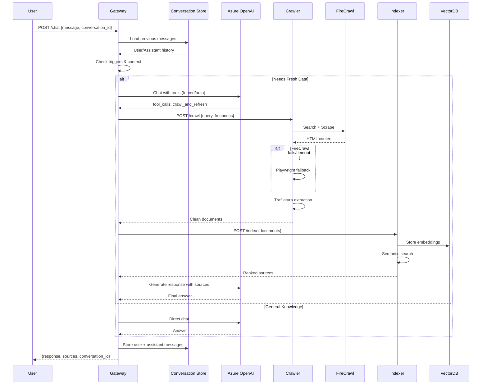
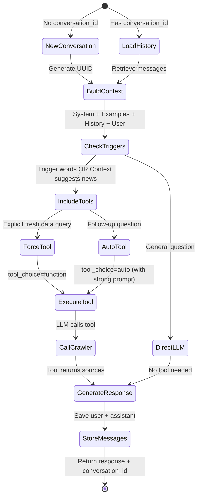

# LLMCrawl System Architecture

## Overview

LLMCrawl is a production-grade Web RAG system that combines LLM chat capabilities with real-time web crawling and semantic search. The system features conversation memory, intelligent tool calling, and robust multi-source web scraping.

## System Components

```
┌─────────────────────────────────────────────────────────────────┐
│                         CLIENT LAYER                             │
├─────────────────────────────────────────────────────────────────┤
│  HiChat Console  │  HiChat WebClient  │  Demo Client  │  cURL   │
└────────┬─────────────────────┬─────────────────┬────────────────┘
         │                     │                 │
         └─────────────────────┼─────────────────┘
                               │
                    HTTP POST /agent/chat
                               │
┌──────────────────────────────▼──────────────────────────────────┐
│                    GATEWAY SERVICE (Port 8000)                   │
├──────────────────────────────────────────────────────────────────┤
│  • FastAPI REST API                                              │
│  • Azure OpenAI / Azure Anthropic / OpenAI SDK                   │
│  • Multi-Provider Routing (OpenAI ChatCompletions / Anthropic    │
│    Messages API via HTTP)                                        │
│  • Conversation Store (In-Memory, 24h TTL)                       │
│  • Tool Calling Logic (OpenAI only, Anthropic uses text)         │
│  • Intelligent Trigger Detection (29+ keywords)                  │
│  • Context-Aware Follow-up Detection                             │
│  • Timeout: 45s (OpenAI), 180s (Anthropic for large contexts)   │
└────┬────────────┬───────────┬────────────────────────────────────┘
     │            │           │ Index Request
     │ Tool Call  │           ▼
     │            │   ┌────────────────────────────────────────────┐
     │            │   │      INDEXER SERVICE (Port 8002)           │
     │            │   ├────────────────────────────────────────────┤
     │            │   │  • LlamaIndex Document Processing          │
     │            │   │  • Embedding Generation                    │
     │            │   │  • Vector DB Storage                       │
     │            │   │  • Semantic Search with Recency Boost      │
     │            │   │  • Source Ranking                          │
     │            │   └────────────────────────────────────────────┘
     │            │                      │
     │            │                      ▼
     │            │      ┌──────────────────────────────┐
     │            │      │  VECTOR DB (Qdrant/pgvector) │
     │            │      └──────────────────────────────┘
     │            │
     │            └─────────────┐
     │                          │
     ▼                          ▼
┌────────────────┐   ┌──────────────────────────────┐
│ CRAWLER (8001) │   │   MCP SERVERS (8003, 8004)   │
├────────────────┤   ├──────────────────────────────┤
│ • FireCrawl    │   │  LOCAL ACCESS (8003)          │
│   Search API   │   │  • Read local files           │
│ • Playwright   │   │  • List directories           │
│   Fallback     │   │  • Semantic search (optional) │
│ • Trafilatura  │   │  • Mounted volume             │
│   Extraction   │   │                               │
│ • Sequential   │   │  AZURE DEVOPS (8004)          │
│   Rendering    │   │  • Code search                │
│ • Auth Support │   │  • File retrieval             │
└────┬───────────┘   │  • MSAL/PAT auth              │
     │               │  • Fast indexed search        │
     │               └──────────────────────────────┘
     ▼
┌─────────────────┐
│ FIRECRAWL (3002)│
├─────────────────┤       ┌──────────────┐
│ • Search & Scrape│───────│ Redis (6379) │ Rate Limiting
│ • Rate Limiting  │       └──────────────┘
│ • Clean HTML     │
└──────────────────┘       ┌──────────────┐
                           │ PostgreSQL   │ Metadata Storage
                           └──────────────┘
```

## Data Flow

### 1. User Query Flow



### 2. Conversation Memory Flow



## Conversation Store Architecture

### Storage Structure

```
ConversationStore (In-Memory)
├── conversations: Dict[conversation_id, List[Message]]
│   └── Message: {role, content, tool_calls?, name?, tool_call_id?}
├── timestamps: Dict[conversation_id, datetime]
├── max_age: 24 hours
└── max_messages: 50 per conversation
```

### Message Flow

**Stored Messages**:
- User messages: `{role: "user", content: "..."}`
- Assistant responses: `{role: "assistant", content: "..."}`

**NOT Stored**:
- System prompts (regenerated each request)
- Few-shot examples (always included)
- Intermediate tool call messages
- Tool result messages

### Context Rebuilding

For each request with `conversation_id`:
```
Final Messages = [
    System Prompt (with current date),
    Few-Shot Examples (NVIDIA, RISC-V),
    Stored User/Assistant History,
    New User Message
]
```

## Tool Calling Intelligence

### Trigger Detection

**29 Trigger Words**:
```
'latest', 'this week', 'this month', 'breaking', 'recent',
'earnings', 'guidance', 'ticker', 'market', 'price',
'launched', 'announced', 'filed', 'SEC', '10-K', '10-Q',
'news', 'update', 'current', 'now', 'just', 'new', 'fresh',
'live', 'today', 's&p', 'sp500', 'dow', 'nasdaq', 'index',
'stock', 'close', 'closing'
```

### Context-Aware Detection

If trigger words NOT in current query, check conversation history:
- Examine last 4 messages
- Look for: `news`, `event`, `headline`, `story`, `article`, `report`, `coverage`
- If found → Include tools for follow-up questions

### Tool Choice Strategy

| Scenario | tool_choice | Behavior |
|----------|-------------|----------|
| Explicit fresh data query | `{"type": "function", "function": {"name": "crawl_and_refresh"}}` | **FORCED**: LLM must call tool |
| Follow-up in news context | `"auto"` | **GUIDED**: Tool available, strong prompt enforcement |
| General question | `null` | No tools included |

## Timeout Configuration

```
User Request
    ↓
Gateway (45s timeout)
    ↓
Crawler (endpoint timeout)
    ↓
FireCrawl (25s asyncio.wait_for)
    ├─ Search API
    └─ Scrape API (per URL)

If FireCrawl times out → Playwright fallback
```

## Environment Configuration

### Critical Settings

```bash
# FireCrawl Redis Connection (Required!)
REDIS_RATE_LIMIT_URL=redis://redis:6379

# Gateway Timeout
GATEWAY_TIMEOUT=45  # seconds

# FireCrawl Timeout
FIRECRAWL_TIMEOUT=25  # seconds

# Conversation Memory
CONVERSATION_MAX_AGE=24  # hours
CONVERSATION_MAX_MESSAGES=50

# LLM Provider
LLM_PROVIDER=azure  # or 'openai'
AZURE_OPENAI_ENDPOINT=https://...
AZURE_OPENAI_API_KEY=...
AZURE_OPENAI_DEPLOYMENT_NAME=gpt-5-chat
AZURE_OPENAI_API_VERSION=2025-01-01-preview
```

## Deployment

### Docker Compose Services

```yaml
services:
  gateway:              # FastAPI + Conversation Store + Multi-LLM
  crawler:              # FireCrawl + Playwright + Trafilatura
  indexer:              # LlamaIndex + Vector DB Client
  mcp-server:           # Local file operations (Port 8003)
  azure-devops-mcp:     # Azure DevOps code search (Port 8004)
  firecrawl:            # Search & Scrape Engine
  qdrant:               # Vector Database
  postgres:             # Metadata Store
  redis:                # Rate Limiting
```

### MCP Server Architecture

#### Local Access MCP Server (Port 8003)

**Purpose**: Secure file operations on mounted local volumes

**Features**:
- Read files with path validation
- List directories with filters
- Semantic search (optional, requires OpenAI API key)
- Security: Path traversal protection

**Configuration**:
```bash
MCP_ROOT_FOLDER=/data/files          # Container path
MCP_VECTOR_DB_PATH=/data/mcp_vector_db  # Optional index
MCP_SERVER_URL=http://mcp-server:8003
```

**Volume Mounting**:
```yaml
volumes:
  - C:/os:/data/files           # Windows
  - /opt/data:/data/files:ro    # Linux (read-only)
```

#### Azure DevOps MCP Server (Port 8004)

**Purpose**: Fast code search across Azure DevOps repositories

**Features**:
- Code search using Azure DevOps Code Search API (100x+ faster)
- File retrieval from specific paths/branches
- MSAL OAuth + PAT authentication
- Automatic search optimization (indexed vs. direct)

**Configuration**:
```bash
AZURE_DEVOPS_ORG=microsoft
AZURE_DEVOPS_PROJECT=OS
AZURE_DEVOPS_REPO=os.2020
AZURE_DEVOPS_BRANCH=official/rs_sparc_ctr_exp
AZURE_DEVOPS_PAT=your-pat-token
AZURE_DEVOPS_MCP_URL=http://azure-devops-mcp:8004
```

**Performance**:
- Keyword searches: ~1 second (was 120+ seconds)
- File pattern + recursive: ~1 second
- Uses `https://almsearch.dev.azure.com` for indexed search

**Tool Selection Logic**:

The gateway automatically routes requests to the appropriate MCP server:

```python
# Local file operations
"List files in /docs folder" → Local MCP (8003)
"Read README.md" → Local MCP (8003)

# Azure DevOps operations
"azdo:find TypeScript files" → Azure DevOps MCP (8004)
"azdo:show config.json" → Azure DevOps MCP (8004)
```

**Prefix Convention**:
- `azdo:` prefix → Azure DevOps MCP
- No prefix → Local MCP (default)

📖 **Documentation**:
- Local MCP: [mcp_servers/local_access_mcp_server/](../mcp_servers/local_access_mcp_server/)
- Azure DevOps MCP: [mcp_servers/azure_devops_mcp_server/](../mcp_servers/azure_devops_mcp_server/)

### Health Checks

- Gateway: `GET /health` (200 OK)
- Crawler: `GET /health` (200 OK)
- Indexer: `GET /health` (200 OK)
- MCP Server (Local): `GET /health` (200 OK)
- Azure DevOps MCP: `GET /health` (200 OK)
- FireCrawl: Port 3002 accessible

## Scaling Considerations

### Current Limitations

1. **Conversation Store**: In-memory (lost on restart)
   - Production: Use Redis with persistence

2. **Sequential Playwright**: No parallel browser instances
   - Reason: Docker stability (prevents crashes)
   - Future: Browser pooling with proper resource limits

3. **Single Gateway Instance**: No load balancing
   - Production: Multiple gateway replicas + Redis conversation store

### Recommended Production Setup

```
                    ┌──────────────┐
                    │ Load Balancer│
                    └──────┬───────┘
                           │
            ┌──────────────┼──────────────┐
            ▼              ▼              ▼
        Gateway-1      Gateway-2      Gateway-3
            │              │              │
            └──────────────┼──────────────┘
                           │
            ┌──────────────┼──────────────┐
            ▼              ▼              ▼
        Crawler-1      Crawler-2      Crawler-3
            │              │              │
            └──────────────┼──────────────┘
                           │
                    ┌──────▼───────┐
                    │ Shared Redis │ (Conversation Store)
                    └──────────────┘
```

## Performance Metrics

| Operation | Typical Time | Max Time |
|-----------|-------------|----------|
| Simple query (no tools) | 500-800ms | 2s |
| News query (with crawl) | 10-15s | 45s |
| Follow-up (with tool) | 8-12s | 45s |
| Conversation load | <10ms | 50ms |

## Troubleshooting

### Common Issues

1. **"I'll fetch..." but no data returned**
   - Cause: Tool not called, tool_choice=auto failed
   - Fix: Check trigger words, verify context detection logs

2. **FireCrawl hanging**
   - Cause: Missing REDIS_RATE_LIMIT_URL
   - Fix: Set environment variable in docker-compose.yml

3. **Conversation context lost**
   - Cause: conversation_id not passed by client
   - Fix: Client must store and send conversation_id

4. **Timeout errors**
   - Cause: Queries taking >45 seconds
   - Fix: Increase GATEWAY_TIMEOUT, optimize crawl depth

5. **Playwright crashes in Docker**
   - Cause: Concurrent browser instances
   - Fix: Sequential rendering already implemented

## Security Considerations

- **API Keys**: Store in `.env`, never commit
- **Rate Limiting**: Redis-backed FireCrawl limits
- **Conversation TTL**: Auto-expire after 24 hours
- **Input Validation**: FastAPI Pydantic models
- **CORS**: Configure for production domains

## Monitoring & Logging

### Log Levels

```python
gateway.routers.chat: INFO
  - "Loaded X previous messages"
  - "Including crawl tool (forced)"
  - "First LLM response has tool_calls: True"

crawler.main: INFO
  - "FireCrawl search completed"
  - "Playwright fallback triggered"

indexer.main: INFO
  - "Indexed X documents"
```

### Key Metrics to Monitor

- Conversation store size (memory usage)
- Tool call success rate
- Average response time
- FireCrawl timeout frequency
- Playwright fallback rate
