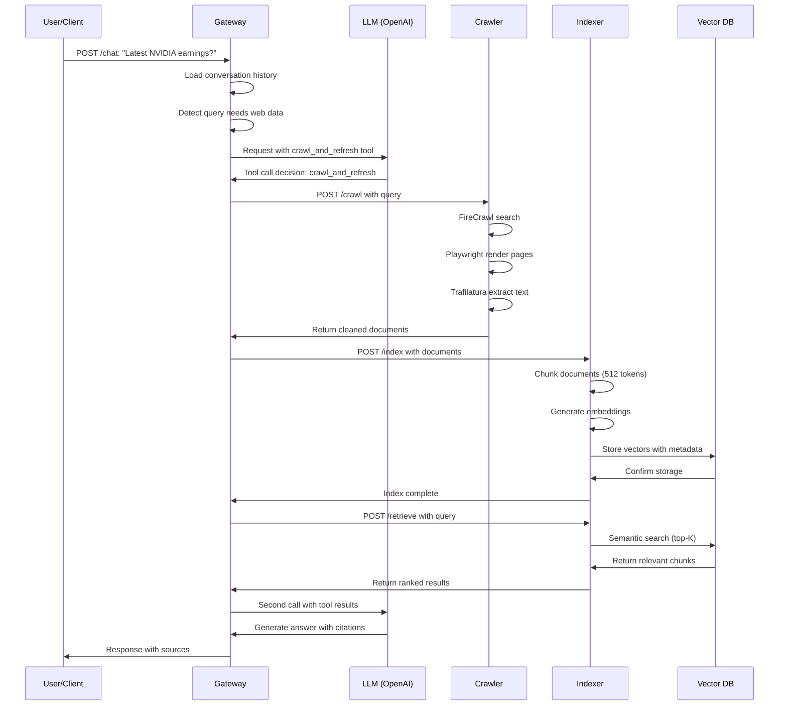
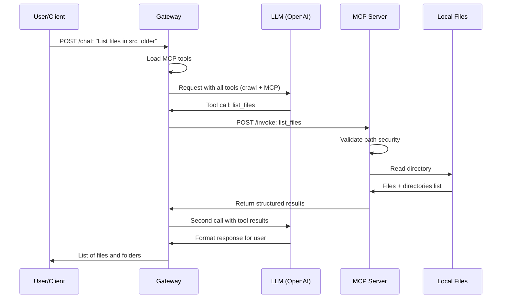
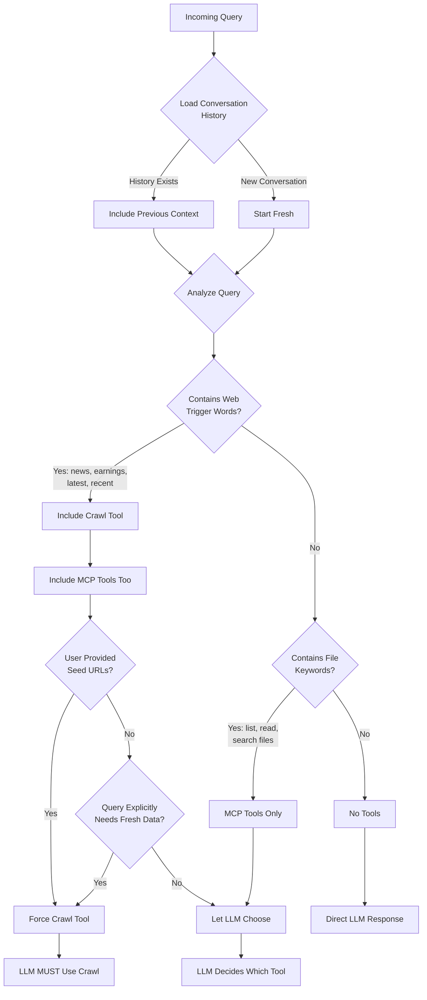

# LLMCrawl System Architecture

## Overview

LLMCrawl is a production-ready RAG (Retrieval-Augmented Generation) system that combines web crawling, local file operations, and conversational AI to provide intelligent, context-aware responses with citations.

## System Components

### 1. Gateway Service (Port 8000)
**Role**: Orchestration and LLM interaction hub

**Responsibilities**:
- Handle incoming chat requests
- Manage conversation history (24-hour TTL)
- Intelligent tool selection and triggering
- Coordinate between crawler, indexer, and MCP server
- Stream responses to clients
- OpenAI/Azure OpenAI SDK integration

**Technology**: FastAPI, Python 3.11, httpx (async HTTP)

**Key Features**:
- Conversation state management
- Multi-turn context preservation
- Automatic tool triggering based on query patterns
- Forced tool execution for data-needing queries
- SSE (Server-Sent Events) streaming support

---

### 2. Crawler Service (Port 8001)
**Role**: Web content extraction and rendering

**Responsibilities**:
- Search web for relevant content
- Render JavaScript-heavy pages with Playwright
- Extract clean text with Trafilatura
- Handle authenticated sites (cookies, headers, basic auth)
- Sequential browser rendering for stability

**Technology**: FastAPI, Playwright (Chromium), Trafilatura, FireCrawl

**Pipeline**:
```
Query → FireCrawl Search → Page Fetch → Playwright Render → Trafilatura Extract → Clean Text
```

**Supported Authentication**:
- Cookie-based (Microsoft SSO, etc.)
- Header-based (API keys)
- Basic Auth
- Bearer tokens

---

### 3. Indexer Service (Port 8002)
**Role**: Document storage and semantic retrieval

**Responsibilities**:
- Chunk documents into manageable pieces
- Generate embeddings (text-embedding-3-large)
- Store in vector database (Qdrant/pgvector)
- Semantic retrieval with recency boost
- Relevance scoring

**Technology**: FastAPI, LlamaIndex, OpenAI Embeddings

**Chunking Strategy**:
- Chunk size: 512 tokens
- Overlap: 50 tokens
- Metadata preserved: URL, title, published_at

**Retrieval**:
- Top-K semantic search
- Recency boost for time-sensitive queries
- Score threshold filtering

---

### 4. MCP Server (Port 8003)
**Role**: Local file operations and semantic file search

**Responsibilities**:
- Read local files securely
- List files and directories
- Index files for semantic search
- Search file content by meaning (not just keywords)
- Path validation and security

**Technology**: FastAPI, LlamaIndex, OpenAI Embeddings (optional)

**Security**:
- Configurable root folder restriction
- Path traversal prevention
- Relative and absolute path validation
- Binary file detection

**Operations**:
1. **list_files**: List files/directories (no embeddings needed)
2. **read_local_file**: Read file content (no embeddings needed)
3. **index_files**: Index for semantic search (requires OpenAI API key)
4. **search_file_content**: Semantic search (requires indexing first)

---

### 5. Supporting Services

#### Vector Database
**Options**:
- **Qdrant** (Recommended): Native vector storage, web UI
- **pgvector**: PostgreSQL extension for vector storage

**Role**: Store and query document embeddings

#### Redis
**Role**: Caching and rate limiting for FireCrawl

#### PostgreSQL
**Role**: Alternative vector storage (when using pgvector)

#### Prometheus + Grafana (Optional)
**Role**: Monitoring, metrics, and alerting

---

## Architecture Diagrams

### High-Level System Architecture

```
┌─────────────────────────────────────────────────────────────────┐
│                         Client Applications                      │
│  (HiChat Web Client, HiChat Console, Direct API Calls)         │
└────────────────────────┬────────────────────────────────────────┘
                         │ HTTP/REST
                         ▼
┌─────────────────────────────────────────────────────────────────┐
│                      Gateway Service (8000)                      │
│  ┌──────────────────────────────────────────────────────────┐  │
│  │  • Conversation Manager (24h TTL)                        │  │
│  │  • Tool Selector & Orchestrator                          │  │
│  │  • LLM Client (OpenAI/Azure)                            │  │
│  │  • Request Router                                        │  │
│  └──────────────────────────────────────────────────────────┘  │
└───┬─────────────────┬─────────────────┬────────────────────┬───┘
    │                 │                 │                    │
    │ Web Crawl      │ Index/Retrieve  │ File Operations   │ LLM API
    │                 │                 │                    │
    ▼                 ▼                 ▼                    ▼
┌─────────┐     ┌──────────┐     ┌──────────┐      ┌──────────────┐
│ Crawler │     │ Indexer  │     │   MCP    │      │ OpenAI/Azure │
│ (8001)  │     │ (8002)   │     │  Server  │      │     API      │
│         │     │          │     │ (8003)   │      │              │
└────┬────┘     └────┬─────┘     └────┬─────┘      └──────────────┘
     │               │                 │
     │               │                 │
     ▼               ▼                 ▼
┌─────────┐    ┌──────────┐    ┌──────────────┐
│FireCrawl│    │ Qdrant/  │    │ Local Files  │
│  Redis  │    │ pgvector │    │  (Mounted)   │
└─────────┘    └──────────┘    └──────────────┘
```

### Request Flow - Web RAG Query



### Request Flow - Local File Query



### Tool Selection Logic



---

## Data Flow

### Web Content Pipeline

```
User Query
    ↓
Gateway detects "latest news"
    ↓
Trigger crawl_and_refresh tool
    ↓
Crawler:
  1. FireCrawl search for URLs
  2. Playwright renders JavaScript
  3. Trafilatura extracts clean text
  4. Returns structured documents
    ↓
Indexer:
  1. Split into 512-token chunks
  2. Generate embeddings
  3. Store in vector DB with metadata
    ↓
Indexer:
  1. Semantic search for relevant chunks
  2. Apply recency boost
  3. Return top-K results
    ↓
Gateway:
  1. Send tool results to LLM
  2. LLM generates answer with citations
    ↓
User receives response with sources
```

### Local File Pipeline

```
User Query: "List files under src/"
    ↓
Gateway loads MCP tools
    ↓
LLM recognizes file operation
    ↓
Calls list_files tool
    ↓
MCP Server:
  1. Validates path (security check)
  2. Resolves to absolute path
  3. Lists files and directories
  4. Returns structured data
    ↓
Gateway sends results to LLM
    ↓
LLM formats friendly response
    ↓
User sees file/folder list
```

---

## Deployment Architectures

### Development Setup

```
┌─────────────────────────────────────────┐
│         Developer Machine                │
│                                          │
│  ┌────────────────────────────────┐    │
│  │  Docker Containers (Hot-Reload)│    │
│  │                                 │    │
│  │  ┌──────────┐  ┌──────────┐   │    │
│  │  │ Gateway  │  │ Crawler  │   │    │
│  │  │  (dev)   │  │  (dev)   │   │    │
│  │  └────┬─────┘  └────┬─────┘   │    │
│  │       │             │          │    │
│  │  Volume Mounts      │          │    │
│  │       ↓             ↓          │    │
│  │  ./gateway/    ./crawler/      │    │
│  │  (Local code - instant reload) │    │
│  └────────────────────────────────┘    │
│                                          │
│  Local Files: C:\os                     │
│       ↓                                  │
│  Mounted to MCP Server as /data/files   │
└─────────────────────────────────────────┘

Features:
✓ Code changes reflect instantly
✓ Debug logging enabled
✓ Direct file access
✓ No rebuild needed
```

### Production Setup

```
┌─────────────────────────────────────────┐
│         Production Server                │
│                                          │
│  ┌────────────────────────────────┐    │
│  │  Docker Containers (Optimized) │    │
│  │                                 │    │
│  │  ┌──────────┐  ┌──────────┐   │    │
│  │  │ Gateway  │  │ Crawler  │   │    │
│  │  │  (prod)  │  │  (prod)  │   │    │
│  │  └────┬─────┘  └────┬─────┘   │    │
│  │       │             │          │    │
│  │  Code baked in images          │    │
│  │  (Immutable, versioned)        │    │
│  └────────────────────────────────┘    │
│                                          │
│  Persistent Volumes:                    │
│  - Vector DB data                       │
│  - Redis cache                          │
│  - Application logs                     │
└─────────────────────────────────────────┘

Features:
✓ Stable, tested images
✓ Version control
✓ Scalable
✓ Rollback support
```

---

## Security Considerations

### MCP Server Security
- **Path Validation**: All file paths validated against configured root
- **No Directory Traversal**: `../` attempts rejected
- **Read-Only by Default**: No write operations without explicit approval
- **Binary Detection**: Non-text files identified and handled safely

### Web Crawler Security
- **Robots.txt Respect**: Honors website crawling rules
- **Rate Limiting**: Prevents aggressive crawling
- **Domain Whitelist**: Optional domain restrictions
- **Authentication**: Secure handling of auth cookies/tokens

### API Security
- **Environment Variables**: Sensitive data in `.env` (not committed)
- **API Key Isolation**: Each service has minimal permissions
- **Network Isolation**: Services communicate on private Docker network

---

## Performance Characteristics

### Latency Breakdown (Typical Query)

```
Total: ~8-15 seconds for web RAG query

Gateway Processing:       100-200ms
├─ Load conversation:     50ms
├─ Tool selection:        50ms
└─ Response formatting:   50ms

Crawler Execution:        5-10 seconds
├─ FireCrawl search:      2-3s
├─ Playwright render:     3-5s
└─ Trafilatura extract:   1-2s

Indexer Processing:       2-3 seconds
├─ Chunking:              100ms
├─ Embedding generation:  1-2s
└─ Vector storage:        500ms

Retrieval:                500ms-1s
├─ Semantic search:       200-500ms
└─ Ranking:               100ms

LLM Response Generation:  2-5 seconds
├─ First LLM call:        1-2s
└─ Second LLM call:       1-3s
```

### Throughput
- **Gateway**: 50-100 requests/minute
- **Crawler**: 10-20 pages/minute (sequential Playwright)
- **Indexer**: 100+ documents/minute
- **MCP Server**: 1000+ file ops/minute

### Resource Usage (Typical)
- **Memory**: 2-4 GB total
  - Gateway: 200-400 MB
  - Crawler: 500-1000 MB (Playwright)
  - Indexer: 300-500 MB
  - MCP Server: 100-200 MB
  - Vector DB: 500-1000 MB
- **CPU**: 1-2 cores for normal load
- **Disk**: 1-5 GB (vector DB + logs)

---

## Scalability

### Horizontal Scaling
- **Gateway**: Multiple instances with load balancer
- **Crawler**: Multiple instances (sequential rendering per instance)
- **Indexer**: Multiple instances (stateless)
- **MCP Server**: Multiple instances (read-only operations)

### Vertical Scaling
- **Vector DB**: Increase RAM for larger document corpus
- **Crawler**: More CPU/RAM for complex JavaScript pages

### Bottlenecks
1. **Playwright Rendering**: CPU-intensive, scales with instances
2. **Embedding Generation**: API rate limits (OpenAI)
3. **Vector Search**: DB size impacts query time

---

## Monitoring and Observability

### Health Checks
- All services expose `/health` endpoint
- Docker healthcheck configuration
- Automatic restart on failure

### Metrics (Prometheus)
- Request rates and latencies
- Tool call distributions
- Cache hit rates
- Error rates

### Logging
- Structured JSON logs
- Request ID tracing
- Tool execution tracking
- Conversation flow logging

### Grafana Dashboards
- Service health overview
- Request latency distribution
- Tool usage analytics
- Error rate trends

---

## Technology Stack Summary

| Component | Technology | Version | Purpose |
|-----------|-----------|---------|---------|
| Gateway | FastAPI | 0.104+ | API orchestration |
| Crawler | Playwright | Latest | JavaScript rendering |
| Indexer | LlamaIndex | 0.9+ | Document chunking |
| MCP Server | FastAPI | 0.104+ | File operations |
| Vector DB | Qdrant | 1.7+ | Embedding storage |
| Cache | Redis | 7 | Rate limiting |
| LLM | OpenAI/Azure | GPT-4 | Response generation |
| Embeddings | OpenAI | text-embedding-3 | Semantic search |
| Container | Docker | 20+ | Service isolation |
| Orchestration | Docker Compose | 2.0+ | Multi-service management |
| Monitoring | Prometheus | Latest | Metrics collection |
| Visualization | Grafana | Latest | Dashboards |

---

## Related Documentation

- [Main README](../README.md) - Quick start and overview
- [MCP Server](../mcp_server/README.md) - Detailed MCP documentation
- [MCP Quickstart](../mcp_server/QUICKSTART.md) - Getting started with file operations
- [Authentication Setup](AUTHENTICATION_SETUP.md) - Crawler authentication
- [Development Guide](DEVELOPMENT.md) - Developer setup
- [Monitoring Guide](MONITORING.md) - Observability setup
